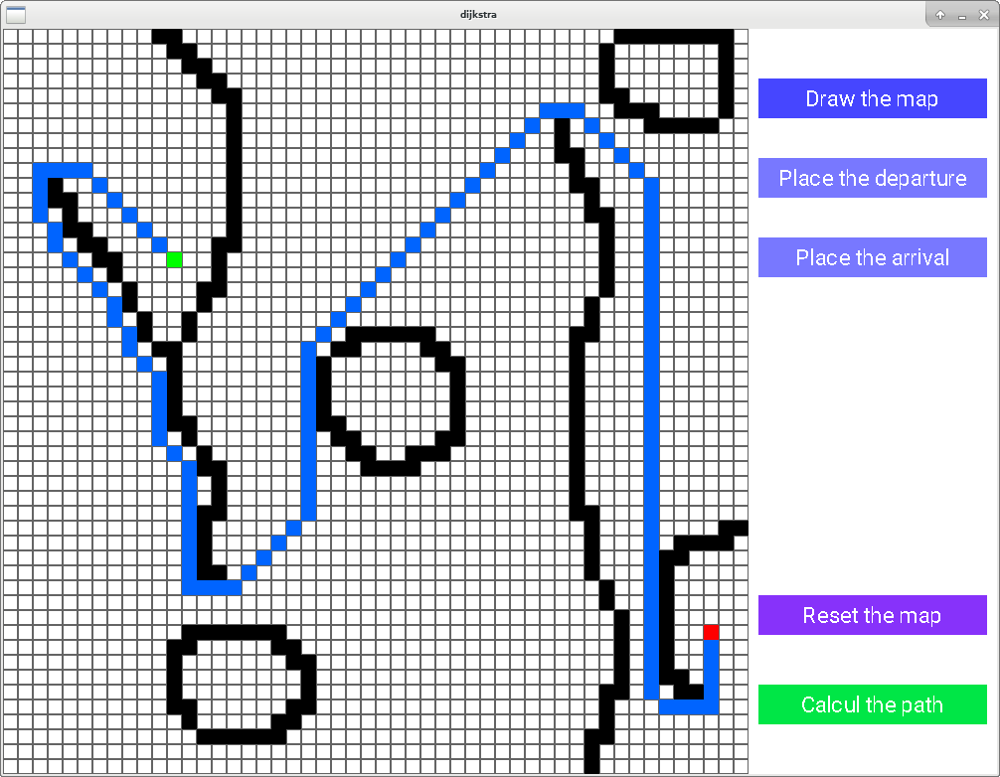

# dijkstra
Little implementation of the dijkstra pathfinding algorithm.



You must install the sdl2 and the sdl2-ttf packages to build the GUI (libsdl2-dev and libsdl2-ttf-dev on Debian).

To build :
```
git clone https://github.com/daiSKeul/dijkstra.git
cd dijkstra
make
./dijkstra
```
